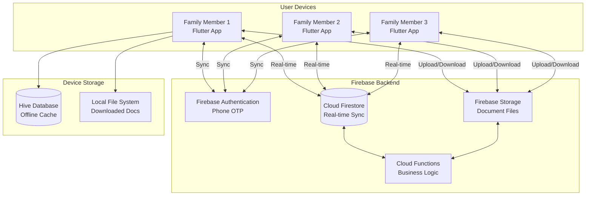
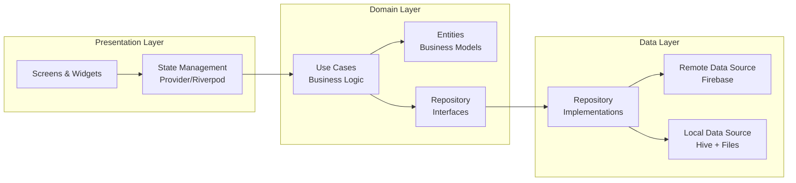
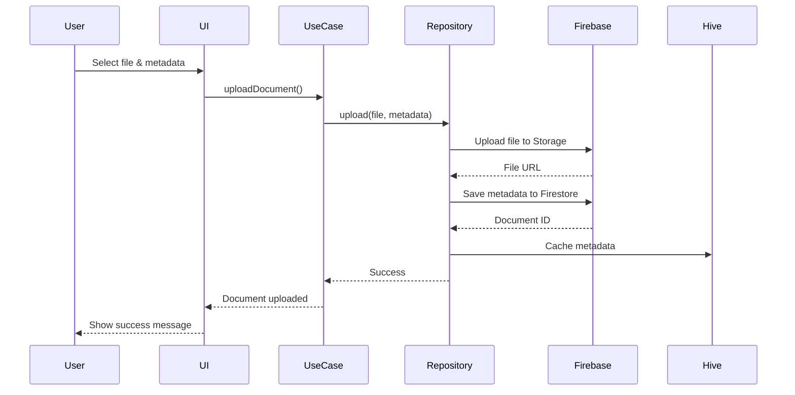
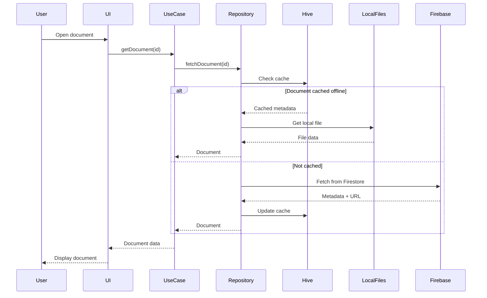
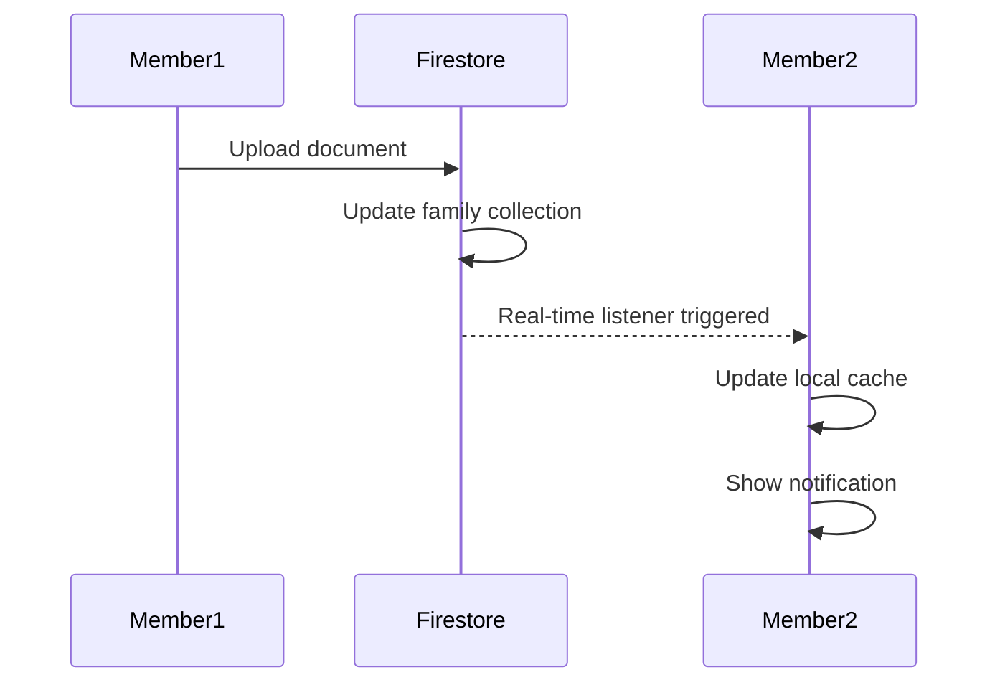
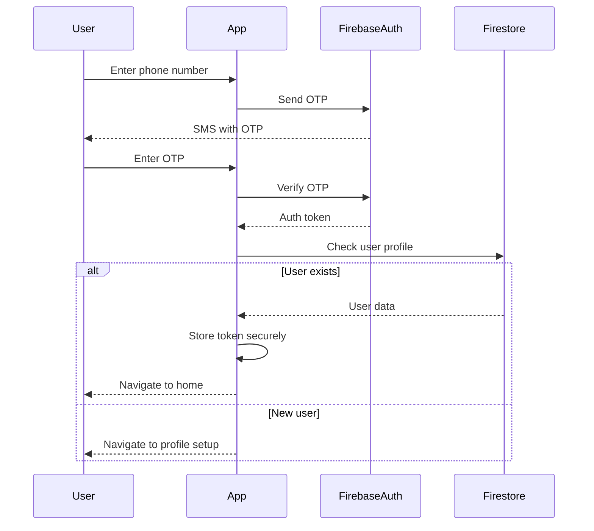
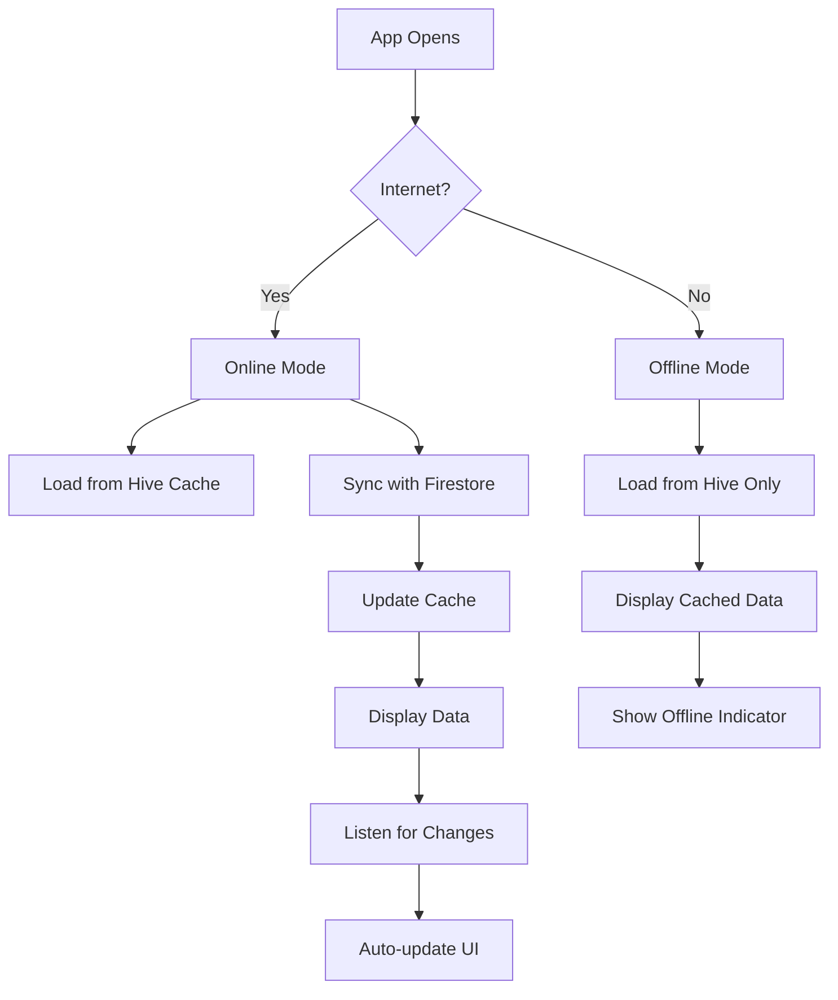
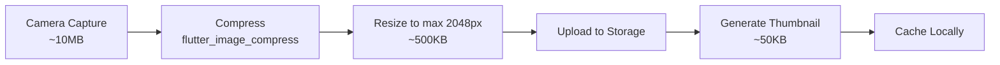
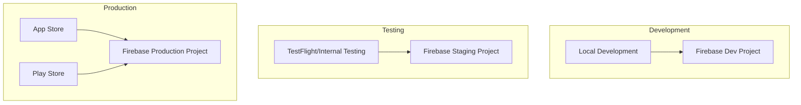

# FamilySphere - Technical Architecture

## System Architecture Overview



## Application Architecture (Clean Architecture)



## Feature Module Structure

Each feature follows the same clean architecture pattern:

```
lib/
├── core/
│   ├── constants/
│   ├── theme/
│   ├── utils/
│   └── widgets/
├── features/
│   ├── auth/
│   │   ├── data/
│   │   ├── domain/
│   │   └── presentation/
│   ├── family/
│   │   ├── data/
│   │   ├── domain/
│   │   └── presentation/
│   ├── documents/
│   │   ├── data/
│   │   ├── domain/
│   │   └── presentation/
│   ├── scanner/
│   │   ├── data/
│   │   ├── domain/
│   │   └── presentation/
│   ├── vault/
│   │   ├── data/
│   │   ├── domain/
│   │   └── presentation/
│   ├── calendar/
│   │   ├── data/
│   │   ├── domain/
│   │   └── presentation/
│   ├── tasks/
│   │   ├── data/
│   │   ├── domain/
│   │   └── presentation/
│   ├── gallery/
│   │   ├── data/
│   │   ├── domain/
│   │   └── presentation/
│   ├── expenses/
│   │   ├── data/
│   │   ├── domain/
│   │   └── presentation/
│   ├── chat/
│   │   ├── data/
│   │   ├── domain/
│   │   └── presentation/
│   └── health/
│       ├── data/
│       ├── domain/
│       └── presentation/
└── main.dart
```

## Data Flow Diagrams

### Document Upload Flow



### Offline Document Access Flow



### Family Sync Flow



## Database Schema

### Firestore Collections

#### `users` Collection
```javascript
{
  userId: "auto-generated-id",
  name: "John Doe",
  phone: "+919876543210",
  photoUrl: "https://...",
  familyId: "family-id",
  role: "admin", // "admin" | "member"
  createdAt: Timestamp,
  lastActive: Timestamp
}
```

#### `families` Collection
```javascript
{
  familyId: "auto-generated-id",
  name: "Doe Family",
  createdBy: "user-id",
  createdAt: Timestamp,
  members: {
    "user-id-1": {
      role: "admin",
      joinedAt: Timestamp
    },
    "user-id-2": {
      role: "member",
      joinedAt: Timestamp
    }
  },
  inviteCode: "ABC123" // Optional
}
```

#### `documents` Collection
```javascript
{
  documentId: "auto-generated-id",
  name: "Passport - John Doe",
  category: "identity", // property|vehicle|identity|education|health|finance|personal
  subcategory: "passport", // Optional
  ownerId: "user-id",
  familyId: "family-id",
  privacy: "shared", // "shared" | "private"
  fileUrl: "https://firebase-storage...",
  thumbnailUrl: "https://...", // Optional
  fileType: "pdf", // "pdf" | "image"
  fileSize: 2048576, // bytes
  tags: ["important", "travel"],
  expiryDate: Timestamp, // Optional
  ocrText: "Extracted text...", // Optional
  version: 1,
  createdAt: Timestamp,
  updatedAt: Timestamp,
  permissions: {
    "user-id-1": "edit",
    "user-id-2": "view"
  }
}
```

#### `activity_logs` Collection
```javascript
{
  logId: "auto-generated-id",
  documentId: "doc-id",
  userId: "user-id",
  action: "viewed", // viewed|downloaded|uploaded|shared|edited|deleted
  timestamp: Timestamp,
  metadata: {
    // Action-specific data
  }
}
```

#### `events` Collection
```javascript
{
  eventId: "auto-generated-id",
  title: "Doctor Appointment",
  description: "Annual checkup",
  familyId: "family-id",
  createdBy: "user-id",
  startTime: Timestamp,
  endTime: Timestamp,
  isRecurring: false,
  recurrenceRule: "WEEKLY", // Optional: DAILY|WEEKLY|MONTHLY|YEARLY
  attendees: ["user-id-1", "user-id-2"],
  linkedDocuments: ["doc-id-1"], // Optional
  color: "#FF5733",
  reminders: [15, 60], // Minutes before event
  createdAt: Timestamp,
  updatedAt: Timestamp
}
```

#### `tasks` Collection
```javascript
{
  taskId: "auto-generated-id",
  title: "Buy groceries",
  description: "Milk, bread, eggs",
  familyId: "family-id",
  category: "shopping", // chores|shopping|errands|homework
  assignedTo: "user-id",
  createdBy: "user-id",
  dueDate: Timestamp,
  priority: "medium", // low|medium|high
  isCompleted: false,
  completedAt: Timestamp, // Optional
  isRecurring: false,
  recurrenceRule: "WEEKLY", // Optional
  createdAt: Timestamp,
  updatedAt: Timestamp
}
```

#### `albums` Collection
```javascript
{
  albumId: "auto-generated-id",
  name: "Vacation 2026",
  familyId: "family-id",
  createdBy: "user-id",
  privacy: "shared", // shared|private
  coverPhotoUrl: "https://...",
  photoCount: 25,
  createdAt: Timestamp,
  updatedAt: Timestamp
}
```

#### `photos` Collection
```javascript
{
  photoId: "auto-generated-id",
  albumId: "album-id",
  familyId: "family-id",
  uploadedBy: "user-id",
  photoUrl: "https://...",
  thumbnailUrl: "https://...",
  caption: "Beach sunset",
  tags: ["vacation", "beach"],
  taggedMembers: ["user-id-1", "user-id-2"],
  isMilestone: false,
  milestoneType: "birthday", // Optional: birthday|graduation|wedding
  takenAt: Timestamp,
  uploadedAt: Timestamp
}
```

#### `expenses` Collection
```javascript
{
  expenseId: "auto-generated-id",
  familyId: "family-id",
  amount: 1500.00,
  currency: "INR",
  category: "groceries", // groceries|utilities|education|healthcare|entertainment
  description: "Weekly grocery shopping",
  paidBy: "user-id",
  splitAmong: ["user-id-1", "user-id-2"],
  receiptDocId: "doc-id", // Optional link to document
  date: Timestamp,
  isRecurring: false,
  recurrenceRule: "MONTHLY", // Optional
  createdAt: Timestamp
}
```

#### `budgets` Collection
```javascript
{
  budgetId: "auto-generated-id",
  familyId: "family-id",
  category: "groceries",
  monthlyLimit: 15000.00,
  currentSpent: 8500.00,
  month: "2026-01",
  alertThreshold: 80, // Percentage
  createdAt: Timestamp
}
```

#### `messages` Collection
```javascript
{
  messageId: "auto-generated-id",
  familyId: "family-id",
  senderId: "user-id",
  messageType: "text", // text|voice|document|photo
  content: "Dinner at 8pm tonight",
  mediaUrl: "https://...", // For voice/photo/document
  isPinned: false,
  readBy: ["user-id-1", "user-id-2"],
  createdAt: Timestamp
}
```

#### `health_profiles` Collection
```javascript
{
  profileId: "user-id",
  familyId: "family-id",
  bloodGroup: "O+",
  allergies: ["Peanuts", "Penicillin"],
  chronicConditions: ["Diabetes"],
  emergencyContact: {
    name: "Dr. Sharma",
    phone: "+919876543210",
    relation: "Family Doctor"
  },
  medications: [
    {
      name: "Metformin",
      dosage: "500mg",
      frequency: "Twice daily",
      startDate: Timestamp,
      endDate: Timestamp // Optional
    }
  ],
  vaccinations: [
    {
      name: "COVID-19",
      date: Timestamp,
      documentId: "doc-id" // Link to certificate
    }
  ],
  updatedAt: Timestamp
}
```

### Hive Local Database

#### Box: `user_cache`
```dart
class UserCache {
  String userId;
  String familyId;
  DateTime lastLogin;
}
```

#### Box: `document_cache`
```dart
class DocumentCache {
  String documentId;
  String name;
  String category;
  String ownerId;
  int version;
  bool isOffline;
  String? localPath;
  DateTime lastSynced;
  DateTime? expiryDate;
  List<String> tags;
  String? ocrText;
}
```

#### Box: `settings_cache`
```dart
class SettingsCache {
  bool autoDownload;
  bool wifiOnly;
  int offlineLimitMB;
  List<String> emergencyDocs;
  bool biometricEnabled;
  String theme; // "light" | "dark" | "system"
}
```

## Security Architecture

### Authentication Flow



### Permission System

**Role Hierarchy:**
- **Admin**: Full control (create, edit, delete, share, manage members)
- **Member**: Limited control (view shared, upload own, edit own)

**Document Privacy Levels:**
- **Shared**: Visible to all family members (respects role permissions)
- **Private**: Visible only to owner (requires biometric unlock)

**Firestore Security Rules:**
```javascript
rules_version = '2';
service cloud.firestore {
  match /databases/{database}/documents {
    
    // Users can only read/write their own profile
    match /users/{userId} {
      allow read: if request.auth.uid == userId;
      allow write: if request.auth.uid == userId;
    }
    
    // Family members can read family data
    match /families/{familyId} {
      allow read: if request.auth.uid in resource.data.members.keys();
      allow write: if request.auth.uid == resource.data.createdBy;
    }
    
    // Document access based on privacy and permissions
    match /documents/{documentId} {
      allow read: if request.auth.uid == resource.data.ownerId
                  || (resource.data.privacy == 'shared' 
                      && request.auth.uid in get(/databases/$(database)/documents/families/$(resource.data.familyId)).data.members.keys());
      
      allow create: if request.auth.uid == request.resource.data.ownerId;
      
      allow update, delete: if request.auth.uid == resource.data.ownerId
                            || get(/databases/$(database)/documents/families/$(resource.data.familyId)).data.members[request.auth.uid].role == 'admin';
    }
  }
}
```

### Data Encryption

**In Transit:**
- All Firebase connections use HTTPS/TLS
- Firestore and Storage enforce encrypted connections

**At Rest:**
- Firebase Storage encrypts files automatically
- Local files marked "private" are encrypted using `flutter_secure_storage` + `encrypt` package
- Sensitive tokens stored in secure keychain (iOS) / KeyStore (Android)

## Offline-First Strategy

### Sync Strategy



### Conflict Resolution

When app comes back online after offline changes:

1. **Version Check**: Compare local version with cloud version
2. **Auto-merge**: If no conflict (different fields changed), merge automatically
3. **User Prompt**: If conflict detected, show user both versions and let them choose
4. **Last-write-wins**: For simple metadata updates

## Performance Optimization

### Image Optimization Pipeline



### Lazy Loading Strategy

- **Document List**: Load 20 items at a time (pagination)
- **Images**: Use `CachedNetworkImage` with placeholder
- **PDFs**: Load first page as thumbnail, full PDF on demand
- **OCR**: Process in background, don't block UI

### Caching Strategy

**Memory Cache:**
- Recently viewed documents (last 10)
- User profile data
- Family member list

**Disk Cache:**
- Document thumbnails (max 100MB)
- Offline documents (user-controlled)
- OCR text (unlimited, small size)

## Scalability Considerations

### Current Design Supports:

- **Family Size**: Up to 20 members per family
- **Documents**: Up to 1,000 documents per family
- **File Size**: Max 10MB per file (configurable)
- **Storage**: Limited by Firebase free tier (5GB) or paid plan

### Future Scaling Options:

1. **Pagination**: Already implemented for document lists
2. **CDN**: Firebase Storage includes CDN automatically
3. **Compression**: Aggressive image/PDF compression
4. **Archival**: Move old documents to "archive" collection
5. **Premium Tier**: Offer paid plans for unlimited storage

## Technology Justification

| Requirement | Technology Choice | Justification |
|-------------|------------------|---------------|
| Cross-platform mobile | Flutter | Single codebase, native performance, rich UI |
| Real-time sync | Cloud Firestore | Real-time listeners, offline support, scalable |
| File storage | Firebase Storage | Secure, scalable, integrated with Firebase |
| Authentication | Firebase Auth | Phone OTP, secure, easy integration |
| Local database | Hive | Fast, NoSQL, no native dependencies |
| State management | Provider/Riverpod | Simple, reactive, officially recommended |
| OCR | Google ML Kit | On-device, offline, accurate, free |
| PDF operations | syncfusion_flutter_pdf | Comprehensive, well-maintained |
| Security | flutter_secure_storage | Platform-native secure storage |

## Deployment Architecture



**Environment Configuration:**
- Use Flutter flavors for dev/staging/prod
- Separate Firebase projects for each environment
- Environment-specific API keys and configurations

---

## Summary

This architecture provides:

✅ **Scalability**: Clean architecture allows easy feature additions  
✅ **Maintainability**: Clear separation of concerns  
✅ **Testability**: Business logic isolated from UI  
✅ **Performance**: Offline-first with smart caching  
✅ **Security**: Multi-layer security (Firebase rules, encryption, biometrics)  
✅ **Reliability**: Offline support with conflict resolution  

The design is production-ready and follows industry best practices for mobile application development.
