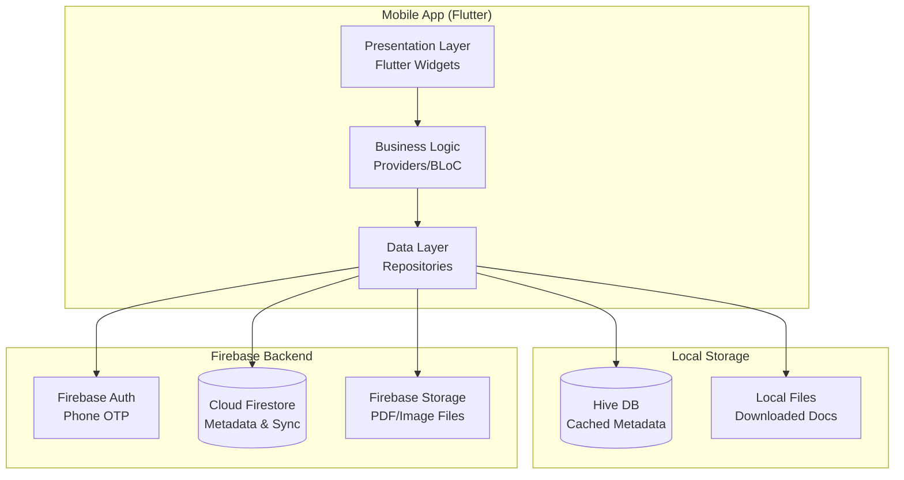

# FamilySphere - Implementation Plan

A family-oriented document management mobile application built with Flutter, featuring online synchronization with selective offline document access.

## Project Overview

**FamilySphere** is a comprehensive family collaboration platform that goes beyond document management. It's designed to be the central hub for family life - managing documents, coordinating schedules, sharing memories, tracking expenses, and staying connected.

### Vision

Create a single app where families can manage their entire household - from important documents to daily tasks, from shared expenses to precious memories.

### Key Objectives

- **Document Hub**: Centralize family and personal documents with secure sharing
- **Family Coordination**: Shared calendar, task lists, and event planning
- **Memory Sharing**: Family photo albums, milestone tracking, and stories
- **Financial Management**: Shared expense tracking and budget management
- **Communication**: Family chat, announcements, and emergency contacts
- **Lifestyle Features**: Shopping lists, meal planning, and family goals
- **Offline-First**: Core features work without internet

## User Review Required

> [!IMPORTANT]
> **Tech Stack Confirmation**
> The implementation uses Flutter instead of the Android Native (Kotlin) stack mentioned in your reference materials. Flutter provides faster development, cross-platform support, and achieves all required features with equivalent libraries.

> [!IMPORTANT]
> **Timeline Expectation**
> The complete implementation is planned for **13 weeks**. Core features (document upload, view, offline access) will be ready by **Week 6**, allowing early testing and iteration.

> [!WARNING]
> **Firebase Costs**
> Firebase free tier covers development and small-scale usage. For production with multiple families and large files, costs may apply. We'll implement file size limits and compression to minimize this.

## Proposed Changes

### Architecture Overview



### Tech Stack (Flutter Equivalent)

| Component | Technology | Purpose |
|-----------|------------|---------|
| **Framework** | Flutter 3.x | Cross-platform mobile development |
| **Language** | Dart | Type-safe, modern language |
| **State Management** | Provider / Riverpod | Reactive state management |
| **Local Database** | Hive | Fast, offline-first NoSQL DB |
| **Backend** | Firebase | Authentication, sync, storage |
| **Authentication** | Firebase Auth | Phone number (OTP) login |
| **Cloud Database** | Cloud Firestore | Real-time family data sync |
| **File Storage** | Firebase Storage | Secure cloud file storage |
| **Camera** | camera + image_picker | Document capture |
| **OCR** | google_mlkit_text_recognition | Offline text extraction |
| **PDF Operations** | pdf, printing, syncfusion_flutter_pdf | PDF create/merge/split |
| **Image Processing** | image, flutter_image_compress | Crop, enhance, compress |
| **PDF Viewer** | syncfusion_flutter_pdfviewer | In-app PDF viewing |
| **Biometrics** | local_auth | Fingerprint/Face unlock |
| **Encryption** | flutter_secure_storage, encrypt | Secure local storage |

---

### Component 1: Project Structure Setup

#### [NEW] Project Folder Structure

```
lib/
├── core/
│   ├── constants/
│   ├── theme/
│   ├── utils/
│   └── widgets/
├── features/
│   ├── auth/
│   │   ├── data/
│   │   ├── domain/
│   │   └── presentation/
│   ├── family/
│   │   ├── data/
│   │   ├── domain/
│   │   └── presentation/
│   ├── documents/
│   │   ├── data/
│   │   ├── domain/
│   │   └── presentation/
│   ├── scanner/
│   │   ├── data/
│   │   ├── domain/
│   │   └── presentation/
│   └── vault/
│       ├── data/
│       ├── domain/
│       └── presentation/
└── main.dart
```

**Clean Architecture Pattern:**
- `domain/` - Business logic, entities, repository interfaces
- `data/` - Repository implementations, data sources, models
- `presentation/` - UI screens, widgets, state management

---

### Component 2: Authentication System

#### [MODIFY] [pubspec.yaml](file:///d:/FamilySphere/pubspec.yaml)

Add Firebase authentication dependencies.

#### [NEW] Authentication Flow

1. **Phone Number Entry** → OTP verification
2. **Profile Setup** → Name, role, profile picture
3. **Family Check** → Create new family or join existing
4. **Dashboard** → Access granted

**Features:**
- Firebase Phone Auth with OTP
- User profile creation
- Family association
- Persistent login with secure token storage

---

### Component 3: Family Management

#### [NEW] Family Data Model

**Firestore Structure:**
```
families/{familyId}
  ├── name: string
  ├── createdBy: userId
  ├── createdAt: timestamp
  └── members: map
      └── {userId}: {role: "admin"|"member", joinedAt: timestamp}

users/{userId}
  ├── name: string
  ├── phone: string
  ├── photoUrl: string
  ├── familyId: string
  └── role: string
```

**Features:**
- Create family
- Generate invite codes
- Add/remove members
- Assign roles (Admin/Member)
- View family member profiles

---

### Component 4: Document Management Core

#### [NEW] Document Data Model

**Firestore Collection:**
```
documents/{documentId}
  ├── name: string
  ├── category: string (property|vehicle|identity|education|personal)
  ├── ownerId: userId
  ├── familyId: string
  ├── privacy: "shared"|"private"
  ├── fileUrl: string
  ├── fileType: "pdf"|"image"
  ├── fileSize: int
  ├── tags: array
  ├── expiryDate: timestamp (optional)
  ├── ocrText: string (optional)
  ├── version: int
  ├── createdAt: timestamp
  ├── updatedAt: timestamp
  └── permissions: map
      └── {userId}: "view"|"edit"
```

**Hive Local Cache:**
```dart
@HiveType(typeId: 0)
class DocumentCache {
  @HiveField(0) String documentId;
  @HiveField(1) String name;
  @HiveField(2) String category;
  @HiveField(3) String ownerId;
  @HiveField(4) bool isOffline;
  @HiveField(5) String? localPath;
  @HiveField(6) DateTime lastSynced;
  @HiveField(7) String? ocrText;
  @HiveField(8) int version;
}
```

**Features:**
- Upload PDF/Image documents
- Download for offline access
- View documents (PDF viewer, image viewer)
- Delete/rename documents
- Document metadata management
- Category-based organization

---

### Component 5: Offline Document Access

#### [NEW] Offline Strategy

**Download Flow:**
```
User taps "Make Available Offline"
  ↓
Download file from Firebase Storage
  ↓
Save to app's local directory
  ↓
Update Hive cache (isOffline = true, localPath = path)
  ↓
Show "Available Offline" badge
```

**Offline Access:**
```
User opens document
  ↓
Check internet connection
  ↓
If offline → Load from localPath
If online → Load from Firebase Storage URL
```

**Features:**
- Download documents for offline viewing
- Offline indicator badge
- Local file management
- Sync status tracking
- Storage usage monitoring

---

### Component 6: Document Operations

#### [NEW] Scanner Module

**Features:**
- Camera integration for document capture
- Auto edge detection (using image processing)
- Manual crop and rotate
- Image enhancement (brightness, contrast)
- Multi-page scanning

#### [NEW] PDF Operations

**Features:**
- Convert images to PDF
- Merge multiple PDFs
- Split PDF pages
- Compress PDFs
- PDF preview

#### [NEW] OCR Integration

**Features:**
- Extract text from images/PDFs using Google ML Kit
- Store OCR text locally for offline search
- Support multiple languages
- Copy extracted text

---

### Component 7: Security & Privacy

#### [NEW] Security Features

**App Lock:**
- PIN/Pattern lock
- Biometric authentication (fingerprint/face)
- Auto-lock after inactivity

**Data Encryption:**
- Secure storage for tokens using `flutter_secure_storage`
- Encrypted local files for "private" documents
- Secure Firestore rules

**Permission System:**
- Role-based access (Admin can manage, Member can view)
- Document-level permissions
- Privacy toggle (Family ↔ Personal)

---

### Component 8: UI/UX Design

#### [NEW] Key Screens

**1. Home Dashboard**
- Family member "face bubbles" (horizontal scroll)
- Category grid (Property, Vehicles, Identity, etc.)
- Family ↔ Personal toggle switch
- Quick search bar

**2. Document List**
- Category-filtered view
- Offline badge indicator
- Sort by date/name
- Swipe actions (share, delete)

**3. Document Detail**
- Full document viewer
- Metadata display
- Actions (download, share, delete, edit)
- OCR text view

**4. Scanner**
- Camera viewfinder with overlay guide
- Capture button
- Gallery import option
- Crop/enhance screen

**5. Family Management**
- Member list with roles
- Invite member flow
- Role management (admin only)

**6. Personal Vault**
- Biometric lock screen
- Private documents only
- Separate UI theme (darker)

---

### Component 9: Family Calendar & Events

#### [NEW] Shared Family Calendar

**Features:**
- Shared family calendar with color-coded events
- Personal + family event views
- Event reminders and notifications
- Birthday and anniversary tracking
- Recurring events (weekly family dinners, monthly bills)
- Event attachments (link documents to events)

**Use Cases:**
- Track doctor appointments for all family members
- Coordinate family gatherings
- Remember important dates (passport renewal, insurance expiry)
- Plan vacations together

---

### Component 10: Family Tasks & To-Do Lists

#### [NEW] Collaborative Task Management

**Features:**
- Shared family task lists
- Assign tasks to family members
- Task categories (household chores, shopping, errands)
- Recurring tasks (weekly grocery shopping)
- Task completion tracking
- Reward system for kids (optional)

**Use Cases:**
- Household chore distribution
- Shared shopping lists
- Family project planning (home renovation)
- Kids' homework tracking

---

### Component 11: Family Photo Gallery & Memories

#### [NEW] Shared Photo Albums

**Features:**
- Family photo albums (auto-organized by date/event)
- Milestone tracking (first steps, graduations, weddings)
- Photo tagging (identify family members)
- Memory timeline
- Private vs shared albums
- Offline photo viewing

**Use Cases:**
- Store family vacation photos
- Track children's growth milestones
- Preserve family history
- Share memories with extended family

---

### Component 12: Family Expense Tracker

#### [NEW] Shared Financial Management

**Features:**
- Shared expense tracking
- Category-based budgeting (groceries, utilities, education)
- Split expenses among members
- Monthly spending reports
- Bill reminders
- Link receipts to expenses (from documents)

**Use Cases:**
- Track household expenses
- Split bills among adult family members
- Monitor monthly budgets
- Plan for big purchases

---

### Component 13: Family Communication Hub

#### [NEW] In-App Family Chat

**Features:**
- Family group chat
- Private member-to-member chat
- Voice messages
- Share documents/photos directly in chat
- Announcements (pinned messages)
- Emergency SOS feature

**Use Cases:**
- Quick family communication
- Share urgent updates
- Coordinate in real-time
- Emergency contact system

---

### Component 14: Family Health & Wellness

#### [NEW] Health Tracking

**Features:**
- Family member health profiles
- Medication reminders
- Vaccination records (linked to documents)
- Doctor appointment history
- Emergency medical information
- Blood group, allergies, chronic conditions

**Use Cases:**
- Track family health history
- Medication schedules for elderly parents
- Emergency medical info access
- Vaccination tracking for kids

---

### Component 15: Smart Features

#### [NEW] AI-Powered Assistance

**Features:**
- Smart document categorization
- Expense auto-categorization from receipts (OCR)
- Birthday/anniversary reminders
- Bill payment reminders
- Document expiry alerts
- Smart search across all content

**Use Cases:**
- Auto-organize uploaded documents
- Never miss important dates
- Proactive reminders for renewals

---

## Verification Plan

### Automated Tests

```bash
# Unit tests for business logic
flutter test test/unit/

# Widget tests for UI components
flutter test test/widget/

# Integration tests
flutter test test/integration/
```

**Test Coverage:**
- Authentication flow
- Document upload/download
- Offline access logic
- Permission checks
- OCR extraction
- PDF operations

### Manual Verification

**Phase 1: Core Functionality (Week 6)**
- [ ] User can register and login
- [ ] User can create/join family
- [ ] User can upload documents
- [ ] User can view documents online
- [ ] User can download documents for offline
- [ ] User can view documents offline (airplane mode test)

**Phase 2: Advanced Features (Week 9)**
- [ ] Document scanning works correctly
- [ ] OCR extracts text accurately
- [ ] PDF merge/split functions properly
- [ ] Family members can share documents
- [ ] Permissions are enforced correctly

**Phase 3: Security (Week 11)**
- [ ] App lock activates correctly
- [ ] Biometric auth works
- [ ] Private documents are hidden from family view
- [ ] Encrypted files cannot be opened externally

**Phase 4: Polish (Week 13)**
- [ ] UI is smooth and responsive
- [ ] Error messages are user-friendly
- [ ] Loading states are clear
- [ ] App handles edge cases gracefully

### Performance Benchmarks

- App launch time: < 2 seconds
- Document upload (5MB): < 10 seconds on 4G
- Offline document open: < 1 second
- Search results: < 500ms
- OCR processing (A4 page): < 5 seconds

---

## Timeline Summary

| Phase | Duration | Deliverable |
|-------|----------|-------------|
| Planning & Design | Week 1 | Architecture, mockups, plan |
| Foundation Setup | Week 1 | Project structure, dependencies |
| Auth & User Management | Week 1 | Login, profiles, family creation |
| Core UI | Week 1 | Dashboard, navigation, layouts |
| **Document Management** | Weeks 2 | Upload, view, download |
| **Offline Access** | Week 1 | Local storage, offline viewing |
| **Document Operations** | Weeks 2 | Scan, OCR, PDF operations |
| **Family Calendar & Tasks** | Week 1 | Shared calendar, task lists |
| **Photo Gallery & Memories** | Week 1 | Photo albums, milestones |
| **Expense Tracker** | Week 1 | Shared expenses, budgets |
| **Family Chat** | Week 1 | In-app messaging |
| **Health & Wellness** | Week 1 | Health profiles, reminders |
| Security & Permissions | Week 1 | App lock, biometrics, roles |
| Testing & Polish | Week 1 | Bug fixes, optimization |
| Finalization | Week 1 | Documentation, demo prep |

**Total: 16 weeks** (expanded for family features)

**Milestone Dates:**
- Week 3: Basic app with login and navigation ✅
- Week 6: Core document features working ✅ (MVP Phase 1)
- Week 9: All document operations complete ✅
- Week 12: Family collaboration features complete ✅ (MVP Phase 2)
- Week 16: Production-ready comprehensive family app ✅

---

## Risk Mitigation

| Risk | Impact | Mitigation |
|------|--------|------------|
| Firebase costs exceed budget | Medium | Implement file size limits (10MB), image compression, monitor usage |
| OCR accuracy issues | Low | Use Google ML Kit (proven), allow manual text editing |
| Offline sync conflicts | Medium | Implement version tracking, show conflict resolution UI |
| Large file performance | Medium | Implement pagination, lazy loading, background processing |
| Complex permission logic | High | Start simple (admin/member), add granular permissions later |

---

## Next Steps

1. **Review and approve this plan**
2. Set up Firebase project (create project, enable Auth, Firestore, Storage)
3. Configure Flutter project dependencies
4. Begin Phase 1: Foundation Setup
