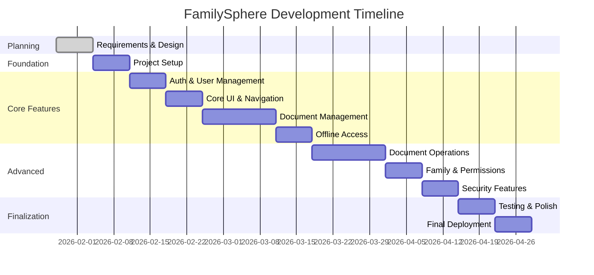

# FamilySphere - Development Timeline

## 13-Week Development Roadmap

### Overview Timeline

---

## Week-by-Week Breakdown

### **Week 1: Planning & Design** ✅ (Current Week)

**Goal:** Complete project planning and design

**Tasks:**
- [x] Define project requirements
- [x] Create architecture design
- [x] Design database schema
- [x] Create implementation plan
- [ ] Design UI mockups (Figma)
- [ ] Set up Firebase project
- [ ] Create Git repository

**Deliverables:**
- ✅ Implementation plan
- ✅ Architecture document
- ✅ Task breakdown
- ⏳ UI mockups
- ⏳ Firebase project configured

---

### **Week 2: Foundation Setup**

**Goal:** Set up project structure and dependencies

**Daily Breakdown:**

**Day 1-2: Project Configuration**
- [ ] Clean up existing Flutter project
- [ ] Set up folder structure (Clean Architecture)
- [ ] Configure `pubspec.yaml` with all dependencies
- [ ] Set up Firebase (Auth, Firestore, Storage)
- [ ] Configure Android/iOS Firebase integration

**Day 3-4: Core Infrastructure**
- [ ] Set up Hive database
- [ ] Create base repository pattern
- [ ] Set up dependency injection (Provider/Riverpod)
- [ ] Create app theme and constants
- [ ] Set up navigation structure

**Day 5: Testing Setup**
- [ ] Configure test environment
- [ ] Create sample unit tests
- [ ] Set up CI/CD basics (optional)

**Deliverables:**
- ✅ Project structure ready
- ✅ All dependencies configured
- ✅ Firebase integrated
- ✅ Navigation working

---

### **Week 3: Authentication & User Management**

**Goal:** Users can register, login, and create/join families

**Daily Breakdown:**

**Day 1-2: Firebase Authentication**
- [ ] Implement phone number input screen
- [ ] Integrate Firebase Phone Auth
- [ ] Implement OTP verification
- [ ] Handle auth errors

**Day 3: User Profile**
- [ ] Create user profile screen
- [ ] Implement profile image upload
- [ ] Save user data to Firestore
- [ ] Create user repository

**Day 4-5: Family Management**
- [ ] Create family creation flow
- [ ] Implement family invitation system
- [ ] Build family member list screen
- [ ] Implement role assignment (Admin/Member)

**Deliverables:**
- ✅ Users can login with phone OTP
- ✅ Users can create profile
- ✅ Users can create/join family
- ✅ Family members visible

---

### **Week 4: Core UI & Navigation**

**Goal:** Build main app interface and navigation

**Tasks:**
- [ ] Build home dashboard layout
- [ ] Create family member "face bubbles" UI
- [ ] Implement Family ↔ Personal toggle
- [ ] Build category grid (Property, Vehicles, etc.)
- [ ] Create document list screen
- [ ] Implement bottom navigation
- [ ] Add search bar UI
- [ ] Create empty states

**Deliverables:**
- ✅ Complete app navigation
- ✅ Home dashboard functional
- ✅ Category-based organization visible

---

### **Week 5-6: Document Management Core**

**Goal:** Users can upload, view, and download documents

**Week 5 Tasks:**
- [ ] Implement file picker (PDF/Image)
- [ ] Build document upload flow
- [ ] Create Firebase Storage integration
- [ ] Implement upload progress indicator
- [ ] Save document metadata to Firestore
- [ ] Build document list with filtering
- [ ] Implement document detail screen

**Week 6 Tasks:**
- [ ] Integrate PDF viewer
- [ ] Integrate image viewer
- [ ] Implement document download
- [ ] Add document delete functionality
- [ ] Implement document rename
- [ ] Add document sharing UI
- [ ] Create document metadata editor

**Deliverables:**
- ✅ Users can upload documents
- ✅ Users can view documents online
- ✅ Users can download documents
- ✅ Document metadata managed

**🎯 MILESTONE: MVP Complete** - Core app is usable!

---

### **Week 7: Offline Document Access**

**Goal:** Downloaded documents work offline

**Tasks:**
- [ ] Implement local file storage
- [ ] Create Hive cache schema
- [ ] Build "Make Available Offline" feature
- [ ] Add "Available Offline" badge
- [ ] Implement offline document opening
- [ ] Create sync status indicator
- [ ] Build storage management screen
- [ ] Implement cache cleanup

**Deliverables:**
- ✅ Documents accessible offline
- ✅ Offline indicator visible
- ✅ Sync status clear

---

### **Week 8-9: Document Operations**

**Goal:** Advanced document processing features

**Week 8 Tasks:**
- [ ] Integrate camera plugin
- [ ] Build document scanner screen
- [ ] Implement auto edge detection
- [ ] Add manual crop functionality
- [ ] Implement image enhancement
- [ ] Build multi-page scanning
- [ ] Add image to PDF conversion

**Week 9 Tasks:**
- [ ] Integrate Google ML Kit OCR
- [ ] Implement text extraction
- [ ] Store OCR text locally
- [ ] Build OCR text viewer
- [ ] Implement PDF merge
- [ ] Implement PDF split
- [ ] Add PDF compression

**Deliverables:**
- ✅ Document scanning works
- ✅ OCR extracts text accurately
- ✅ PDF operations functional

---

### **Week 10: Family & Permissions**

**Goal:** Family collaboration features

**Tasks:**
- [ ] Build family management screen
- [ ] Implement member invitation flow
- [ ] Create invite code system
- [ ] Build role management UI (Admin only)
- [ ] Implement document sharing
- [ ] Create permission controls
- [ ] Add access restriction logic
- [ ] Build activity logs
- [ ] Implement share notifications

**Deliverables:**
- ✅ Family members can collaborate
- ✅ Permissions enforced
- ✅ Document sharing works

---

### **Week 11: Security Features**

**Goal:** Secure the application

**Tasks:**
- [ ] Implement app lock (PIN/Pattern)
- [ ] Integrate biometric authentication
- [ ] Create secure folder/document lock
- [ ] Implement encrypted local storage
- [ ] Add secure token management
- [ ] Build privacy toggle logic
- [ ] Implement auto-lock
- [ ] Add security settings screen

**Deliverables:**
- ✅ App lock functional
- ✅ Biometric auth works
- ✅ Private documents secured

---

### **Week 12: Testing & Polish**

**Goal:** Stable, polished application

**Tasks:**
- [ ] Comprehensive offline testing
- [ ] Network failure testing
- [ ] Permission testing
- [ ] Large file testing
- [ ] UI/UX polish
- [ ] Error handling improvements
- [ ] Loading state refinements
- [ ] Performance optimization
- [ ] Fix all critical bugs

**Deliverables:**
- ✅ App stable and polished
- ✅ All major bugs fixed
- ✅ Performance optimized

---

### **Week 13: Finalization**

**Goal:** Production-ready application

**Tasks:**
- [ ] Final bug fixes
- [ ] Create demo data
- [ ] Prepare user documentation
- [ ] Create presentation (PPT)
- [ ] Write project report
- [ ] Record demo video
- [ ] Prepare for deployment
- [ ] Final testing

**Deliverables:**
- ✅ Production-ready app
- ✅ Documentation complete
- ✅ Presentation ready

---

## Team Distribution (For 4-Member Team)

### **Member 1: UI/UX Lead**
**Responsibilities:**
- All screens and widgets
- Navigation flow
- Theme and styling
- User experience

**Weekly Focus:**
- Week 2: Setup UI structure
- Week 3: Auth screens
- Week 4: Dashboard and navigation
- Week 5-6: Document screens
- Week 7: Offline indicators
- Week 8-9: Scanner UI
- Week 10: Family screens
- Week 11: Security screens
- Week 12-13: Polish and testing

---

### **Member 2: Document Operations Specialist**
**Responsibilities:**
- File handling
- Camera integration
- Image processing
- PDF operations
- OCR integration

**Weekly Focus:**
- Week 2: File picker setup
- Week 3: Profile image upload
- Week 5-6: Document upload/download
- Week 7: Local file storage
- Week 8-9: Scanner and OCR (HEAVY)
- Week 10: Document sharing
- Week 12-13: Testing and optimization

---

### **Member 3: Backend & Data Engineer**
**Responsibilities:**
- Firebase integration
- Firestore operations
- Storage management
- Data models
- Repository pattern

**Weekly Focus:**
- Week 2: Firebase setup (CRITICAL)
- Week 3: Auth and user management
- Week 5-6: Document CRUD operations
- Week 7: Sync logic
- Week 10: Family and permissions
- Week 11: Security rules
- Week 12-13: Performance and testing

---

### **Member 4: Security & Integration Lead**
**Responsibilities:**
- Local database (Hive)
- Offline logic
- Security features
- Integration testing
- Bug fixing

**Weekly Focus:**
- Week 2: Hive setup
- Week 3: User cache
- Week 5-6: API integration
- Week 7: Offline access (HEAVY)
- Week 8-9: OCR cache
- Week 10: Permission logic
- Week 11: Security features (HEAVY)
- Week 12-13: Testing and fixes

---

## Learning Resources (Phase-Wise)

### **Phase 1: Flutter Basics (Week 2)**
**Topics:**
- Dart fundamentals
- Flutter widgets
- State management basics
- Navigation

**Resources:**
- Flutter official docs: flutter.dev/docs
- YouTube: "Flutter Crash Course" by Traversy Media
- Practice: Build a simple todo app

---

### **Phase 2: Firebase (Week 2-3)**
**Topics:**
- Firebase setup
- Authentication
- Firestore CRUD
- Storage upload/download

**Resources:**
- Firebase Flutter docs: firebase.google.com/docs/flutter
- YouTube: "Firebase Flutter Tutorial" by The Net Ninja
- Practice: Build a simple notes app with Firebase

---

### **Phase 3: Local Storage (Week 7)**
**Topics:**
- Hive database
- File system access
- Caching strategies

**Resources:**
- Hive docs: docs.hivedb.dev
- path_provider package docs
- Practice: Cache API responses locally

---

### **Phase 4: Camera & Image Processing (Week 8)**
**Topics:**
- Camera plugin
- Image manipulation
- PDF generation

**Resources:**
- camera package docs
- image package docs
- pdf package docs

---

### **Phase 5: OCR (Week 9)**
**Topics:**
- Google ML Kit
- Text recognition
- On-device processing

**Resources:**
- google_mlkit_text_recognition docs
- ML Kit official docs
- Practice: Build a simple text scanner

---

### **Phase 6: Security (Week 11)**
**Topics:**
- Biometric authentication
- Secure storage
- Encryption

**Resources:**
- local_auth package docs
- flutter_secure_storage docs
- encrypt package docs

---

## Key Milestones

| Week | Milestone | Demo-able Feature |
|------|-----------|-------------------|
| 3 | Authentication Complete | User can login and create profile |
| 4 | UI Complete | Full app navigation works |
| 6 | **MVP Complete** | Upload, view, download documents |
| 7 | Offline Ready | Documents work offline |
| 9 | Advanced Features | Scan, OCR, PDF operations |
| 11 | Security Complete | App lock, biometric auth |
| 13 | **Production Ready** | Fully functional app |

---

## Risk Timeline

| Week | Potential Risk | Mitigation |
|------|----------------|------------|
| 2 | Firebase setup issues | Follow official docs carefully, test early |
| 5-6 | File upload complexity | Start with small files, add compression |
| 7 | Offline sync conflicts | Implement simple version tracking |
| 8-9 | OCR accuracy issues | Use Google ML Kit (proven), allow manual edit |
| 11 | Security implementation | Use established packages, test thoroughly |

---

## Daily Checklist Template

**Morning:**
- [ ] Review yesterday's progress
- [ ] Check task.md for today's goals
- [ ] Pull latest code (if team)

**During Development:**
- [ ] Write code
- [ ] Test locally
- [ ] Commit frequently
- [ ] Update task.md

**Evening:**
- [ ] Test today's changes
- [ ] Push code
- [ ] Update progress
- [ ] Plan tomorrow

---

## Success Criteria

**Week 6 (MVP):**
- ✅ User can register and login
- ✅ User can upload a document
- ✅ User can view document online
- ✅ User can download for offline
- ✅ User can view offline

**Week 13 (Final):**
- ✅ All planned features working
- ✅ No critical bugs
- ✅ App is secure
- ✅ Performance is good
- ✅ Documentation complete

---

This timeline is realistic and achievable. Focus on completing each week's goals before moving forward. The Week 6 MVP is your safety net - even if later weeks take longer, you'll have a working app to demo!
